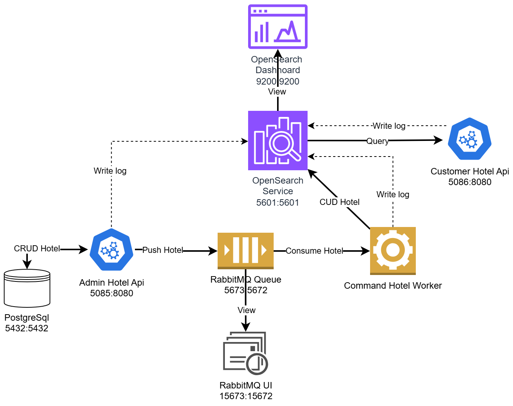

# Demo Microservice with Dotnet

- Demo 1 kiến trúc microservice đơn giản với RabbitMQ, OpenSearch, PostgreSql
  

- Gồm:
  - 1 PostgreSql cho database lưu dữ liệu
  - 1 RabbitMQ cho message queue
  - 1 OpenSearch cho thu thập log và dữ liệu
  - 1 Api admin quản lý dữ liệu Hotel
  - 1 Api customer truy vấn dữ liệu Hotel
  - 1 Worker thực hiện cập nhật vào opensearch

## Menu

1. [Feature](#feature)
2. [Required](#required)
3. [Build and Run](#build-and-run)
4. [Display](#display)
5. [Folder structure](#folder-structure)

## Feature

- PostgreSql có chức năng lưu trữ dữ liệu hotel được CRUD bởi AdminHotelApi
- OpenSearch và OpenSearch Dashboard
  - Lưu trữ dữ liệu Hotel
  - Cho CustomerHotelApi truy vấn dữ liệu Hotel
  - Nhận log ứng dụng từ AdminHotelApi, CommandHotelWorker và CustomerHotelApi
- RabbitMQ
  - Nhận yêu cầu Thêm/Sửa/Xóa dữ liệu hotel từ AdminHotelApi
  - Đẩy yêu cầu Thêm/Sửa/Xóa dữ liệu hotel tới CommandHotelWorker
- Các services:
  - AdminHotelApi
    - Cho Admin Đọc/Thêm/Sửa/Xóa dữ liệu hotel
    - Thực hiện đẩy dữ liệu Hotel vào RabbitMQ
  - CommandHotelWorker
    - Nhận message Thêm/Sửa/Xóa dữ liệu hotel từ RabbitMQ
    - Cập nhật dữ liệu Hotel vào OpenSearch
  - CustomerHotelApi
    - Cho customer truy vấn dữ liệu Hotel

## Required

- Cài đặt docker
- Nếu muốn develop thì cài thêm dotnet sdk 9.0

## Build and Run

1. Build image admin-hotel-api

```terminal
docker build -t admin-hotel-api ./services/AdminHotelApi
```

2. Build image command-hotel-worker

```terminal
docker build -t command-hotel-worker ./services/CommandHotelWorker
```

3. Build image customer-hotel-api

```terminal
docker build -t customer-hotel-api ./services/CustomerHotelApi
```

4. Dựng docker container

```terminal
docker compose up -d
```

5. Sau khi chạy thành công, có thể mở các service trên website mục [Display](#display)

## Display

### OpenSearch Dashboard

- Link: https://localhost:5601
- User: admin
- Pass: openSearch@123

### RabbitMQ UI

- Link: http://localhost:15673
- User: guest
- Pass: guest

### PostgreSql

- Dùng tool pgAdmin4
- host: localhost:5432
- DB: mydb
- User: postgres
- Pass: postgres

### Services:

- AdminHotelApi: http://localhost:5085
- CustomerHotelApi: http://localhost:5086

## Folder structure

- docker-compose.yml: file cấu hình docker compose
- services:
  - AdminHotelApi: api quản trị hotel
  - CustomerHotelApi: api hotel của khách hàng
  - CommandHotelWorker: job thực hiện cập nhật hotel
  - TestConsole: Console dùng để nghịch ngợm
- data:
  - opensearch: folder chứa data của opensearch
  - postgres: folder chứa data của postgreSql
  - AdminHotelApi: folder chứa file (bao gồm logs) của service AdminHotelApi
  - CustomerHotelApi: folder chứa file (bao gồm logs) của service CustomerHotelApi
  - CommandHotelWorker: folder chứa file (bao gồm logs) của job CommandHotelWorker
- document: folder chứa file tài liệu (hiện tại chưa có)
- images: folder chứa file ảnh, sơ đồ
